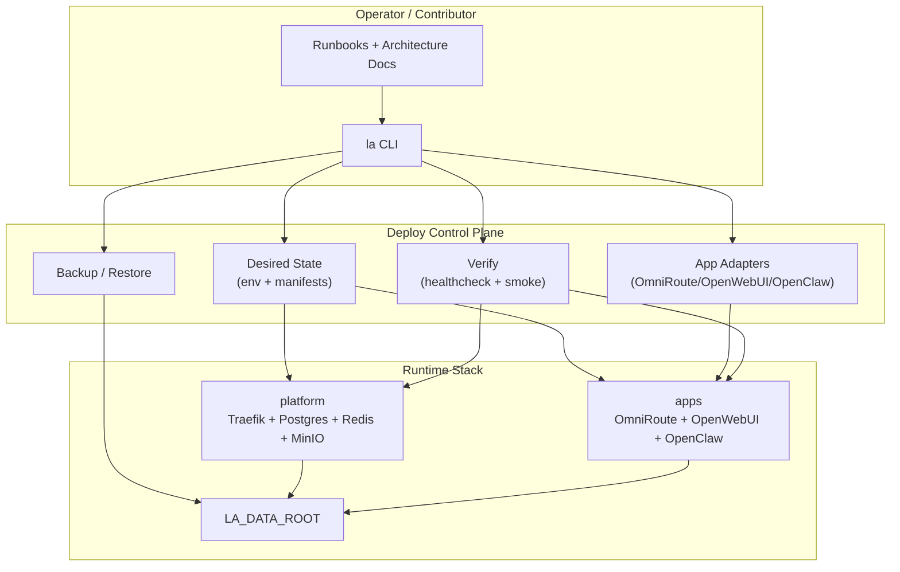

# Deploy Architecture Review

_Last reviewed: 2026-04-11_

## 1. Mục tiêu

Tài liệu này review kiến trúc vận hành hiện tại của stack `LocalAgent` theo góc nhìn DevOps:

- dễ học cho người mới
- dễ deploy local và server
- hỗ trợ deploy toàn stack hoặc từng phần
- backup/restore rõ ràng
- ít coupling với internals của từng app
- an toàn hơn cho rollout và contributor workflow

Phạm vi đối chiếu:

- `deploy/`
- `ops/`
- `artifacts/`
- các tài liệu runtime hiện có trong `docs/`

## 2. Tóm tắt điều đang làm đúng

Nền hiện tại không tệ. Có 4 điểm nên giữ:

- Tách stack thành `platform` và `apps` là đúng hướng, đã phản ánh khá rõ failure domain.
- `deploy/scripts/stack.sh` là foundation tốt cho partial operations giữa 2 layer.
- `healthcheck.sh` và `smoke_stack.sh` đã đưa deploy vượt mức "container up" sang kiểm tra routing và luồng chat thật.
- Data layout dưới `${LA_DATA_ROOT}` đã tương đối rõ ownership giữa `platform/*` và `apps/*`.

Nếu refactor tiếp, nên giữ nguyên tư duy 2-layer này thay vì quay lại một unified stack lớn.

## 3. Findings

### P0. Deploy đang mutate trực tiếp internal state của nhiều app

`deploy/scripts/bootstrap_app_clients.sh` đang can thiệp thẳng vào state nội bộ của 3 hệ khác nhau:

- chọc trực tiếp OmniRoute SQLite để tạo/sửa `api_keys` ở [deploy/scripts/bootstrap_app_clients.sh](/Users/thont/Local/POC/LocalAgent/deploy/scripts/bootstrap_app_clients.sh#L78)
- sửa trực tiếp bảng `config` của OpenWebUI Postgres ở [deploy/scripts/bootstrap_app_clients.sh](/Users/thont/Local/POC/LocalAgent/deploy/scripts/bootstrap_app_clients.sh#L135)
- sửa trực tiếp Redis runtime keys của OpenWebUI ở [deploy/scripts/bootstrap_app_clients.sh](/Users/thont/Local/POC/LocalAgent/deploy/scripts/bootstrap_app_clients.sh#L169)
- lấy catalog OmniRoute rồi seed OpenClaw config bằng logic shell bootstrap ở [deploy/scripts/bootstrap_app_clients.sh](/Users/thont/Local/POC/LocalAgent/deploy/scripts/bootstrap_app_clients.sh#L188)

Đây là coupling mạnh nhất trong toàn bộ deploy path. Mỗi lần upstream schema đổi, deploy có thể gãy dù container vẫn build được. Người mới muốn hiểu "cách deploy" hiện phải hiểu thêm SQLite schema của OmniRoute, Postgres schema của OpenWebUI, Redis key layout của OpenWebUI, và config model của OpenClaw.

### P0. Deploy server đang unsafe và mang tính cá nhân hóa quá mạnh

`ops/deploy_server.sh` hiện hard-code assumption của một operator cụ thể:

- mặc định remote là `mzk-12-10@100.101.77.8` ở [ops/deploy_server.sh](/Users/thont/Local/POC/LocalAgent/ops/deploy_server.sh#L6)
- yêu cầu password SSH qua `SERVER_SSH_PASS` ở [ops/deploy_server.sh](/Users/thont/Local/POC/LocalAgent/ops/deploy_server.sh#L10)
- dùng `sshpass` và tắt host-key checking ở [ops/deploy_server.sh](/Users/thont/Local/POC/LocalAgent/ops/deploy_server.sh#L17)

Baseline này không phù hợp cho CI, không phù hợp cho contributor, và cũng không nên là đường deploy chuẩn cho production-like server.

### P1. Server deploy và local deploy không đối xứng

Local deploy build cả OmniRoute và OpenClaw ở [ops/deploy_local.sh](/Users/thont/Local/POC/LocalAgent/ops/deploy_local.sh#L186), còn server deploy chỉ build OmniRoute ở [ops/deploy_server.sh](/Users/thont/Local/POC/LocalAgent/ops/deploy_server.sh#L24), nhưng vẫn restart `open-webui` và `openclaw-gateway` ở [ops/deploy_server.sh](/Users/thont/Local/POC/LocalAgent/ops/deploy_server.sh#L50).

Hệ quả:

- mental model giữa local và server không thống nhất
- thay đổi trong repo `openclaw/` không có đường ship rõ ràng lên server
- contributor khó biết service nào là "source-built", service nào là "image-pinned"

### P1. Entry point vận hành bị phân mảnh

`deploy/DEPLOY_KNOWLEDGE.md` thừa nhận source-of-truth theo thứ tự `ops -> scripts -> env -> docs` ở [deploy/DEPLOY_KNOWLEDGE.md](/Users/thont/Local/POC/LocalAgent/deploy/DEPLOY_KNOWLEDGE.md#L5). Điều này phản ánh đúng thực tế, nhưng cũng cho thấy người mới không có một operational surface duy nhất.

Hiện có quá nhiều điểm vào:

- `ops/agent.sh`
- `ops/deploy_local.sh`
- `ops/deploy_server.sh`
- `deploy/scripts/stack.sh`
- nhiều bootstrap script riêng lẻ

Kết quả là muốn hiểu kiến trúc deploy phải đọc nhiều shell imperative thay vì một contract rõ ràng.

### P1. OpenClaw proxy trust đang phụ thuộc vào IP động của container Traefik

`deploy/scripts/bootstrap_openclaw.sh` inspect IP hiện tại của Traefik rồi ghi `gateway.trustedProxies` thành `<ip>/32` ở [deploy/scripts/bootstrap_openclaw.sh](/Users/thont/Local/POC/LocalAgent/deploy/scripts/bootstrap_openclaw.sh#L35) và [deploy/scripts/bootstrap_openclaw.sh](/Users/thont/Local/POC/LocalAgent/deploy/scripts/bootstrap_openclaw.sh#L71).

Điều này brittle vì:

- recreate network/container là IP có thể đổi
- config OpenClaw có thể stale sau những thay đổi Docker network bình thường
- deploy phải dựa vào một bước reconcile bổ sung chỉ để sửa proxy trust

### P1. Backup hiện chưa phải là backup của toàn hệ thống

`deploy/scripts/backup_snapshot.sh` hiện chỉ tar một phần state:

- OmniRoute data
- OpenClaw config/workspace
- OpenWebUI runtime
- MinIO data

ở [deploy/scripts/backup_snapshot.sh](/Users/thont/Local/POC/LocalAgent/deploy/scripts/backup_snapshot.sh#L11)

Nhưng chưa cover rõ:

- Postgres snapshot nhất quán tại thời điểm backup
- Redis persistence/runtimes cần giữ hay không
- manifest snapshot
- restore script
- quy trình verify restore

`artifacts/README.md` còn ghi đây không phải deploy path chuẩn ở [artifacts/README.md](/Users/thont/Local/POC/LocalAgent/artifacts/README.md#L6), nên hiện chưa có một "recovery contract" hoàn chỉnh.

### P2. Env model đang duplicate secrets và derived URLs

`deploy/env/stack.env.example` lặp secret ở nhiều nơi:

- `POSTGRES_PASSWORD` phải đồng bộ thủ công với `OPENWEBUI_DATABASE_URL` ở [deploy/env/stack.env.example](/Users/thont/Local/POC/LocalAgent/deploy/env/stack.env.example#L12) và [deploy/env/stack.env.example](/Users/thont/Local/POC/LocalAgent/deploy/env/stack.env.example#L65)
- `REDIS_PASSWORD` phải đồng bộ với 2 URL Redis ở [deploy/env/stack.env.example](/Users/thont/Local/POC/LocalAgent/deploy/env/stack.env.example#L18), [deploy/env/stack.env.example](/Users/thont/Local/POC/LocalAgent/deploy/env/stack.env.example#L68), [deploy/env/stack.env.example](/Users/thont/Local/POC/LocalAgent/deploy/env/stack.env.example#L69)
- `MINIO_ROOT_PASSWORD` phải đồng bộ với `OPENWEBUI_S3_SECRET_ACCESS_KEY` ở [deploy/env/stack.env.example](/Users/thont/Local/POC/LocalAgent/deploy/env/stack.env.example#L21) và [deploy/env/stack.env.example](/Users/thont/Local/POC/LocalAgent/deploy/env/stack.env.example#L74)

Đây là nguồn drift phổ biến khi rotate secret hoặc onboarding một môi trường mới.

### P2. Local deploy mặc định stop toàn stack trước khi build/deploy

`ops/deploy_local.sh` default `DEPLOY_LOCAL_STOP_FIRST=1` ở [ops/deploy_local.sh](/Users/thont/Local/POC/LocalAgent/ops/deploy_local.sh#L179), sau đó down cả `apps` và `platform` ở [ops/deploy_local.sh](/Users/thont/Local/POC/LocalAgent/ops/deploy_local.sh#L182).

Cách này giúp giảm RAM, nhưng làm chậm inner loop của dev:

- mất state warm
- tăng downtime local
- biến deploy local thành "redeploy all" thay vì "update service đang sửa"

## 4. Kết luận kiến trúc

Vấn đề chính của hệ thống hiện tại không nằm ở Docker layout 2-layer. Vấn đề nằm ở chỗ:

- deploy contract chưa đủ tách khỏi app internals
- operational surface chưa được gom thành một CLI chuẩn
- backup/restore chưa được xem là feature hạng 1
- local/server workflows chưa thống nhất một mô hình rollout

Nói ngắn gọn: runtime topology đã tương đối sạch, nhưng deploy topology vẫn còn "script-driven" quá nhiều.

## 5. Target State đề xuất

### 5.1 Một bề mặt vận hành duy nhất

Giữ `deploy/` làm source of truth thật. `ops/` nên chỉ còn wrapper mỏng hoặc bị loại bỏ.

Đề xuất entrypoint duy nhất:

```text
deploy/bin/la
```

Các lệnh chuẩn:

```bash
la init local
la init server

la up platform
la up apps
la up all

la down platform
la down apps
la down all

la deploy omniroute
la deploy openwebui
la deploy openclaw
la deploy all

la bootstrap openclaw
la bootstrap clients
la bootstrap all

la status
la verify

la backup create all
la backup create db
la backup restore <snapshot>
```

Người mới chỉ cần học một contract này, thay vì học nhiều shell script rời rạc.

### 5.2 Deploy units phải là first-class concept

Hệ thống hiện có đủ nền để hỗ trợ partial deploy, nhưng chưa định nghĩa chính thức. Nên chuẩn hóa 5 unit:

| Unit | Scope |
| --- | --- |
| `platform` | Postgres, Redis, MinIO, Traefik |
| `omniroute` | router/dashboard/API |
| `openwebui` | frontend chat app |
| `openclaw` | gateway + CLI |
| `bootstrap` | reconcile config sau deploy |

Luật vận hành nên rõ:

- code change ở `OmniRoute/` không được kéo theo restart toàn bộ `platform`
- code change ở `openclaw/` phải có đường build/deploy riêng lên server
- `bootstrap` chỉ chạy khi config drift hoặc sau init/restore, không nên là bước bắt buộc sau mọi deploy nhỏ

### 5.3 Desired state phải tách khỏi runtime generated state

Nên chuẩn hóa cây deploy như sau:

```text
deploy/
  bin/
    la
  compose/
    platform.yml
    apps.yml
  env/
    defaults.env
    targets/
      local.env
      server.env
    secrets/
      .gitignore
      local.env
      server.env
  manifests/
    apps/
      omniroute.env.tpl
      openwebui.env.tpl
      openclaw.env.tpl
  scripts/
    ...
```

Nguyên tắc:

- file committed chỉ chứa defaults và target shape
- secrets nằm riêng, không lặp vào nhiều biến derived
- URLs/DSN được render từ primitives ở bước generate
- runtime generated files chỉ nằm dưới `${LA_DATA_ROOT}`

### 5.4 Bootstrap phải chuyển từ DB-hack sang app-owned reconcile

`bootstrap_app_clients.sh` hiện làm được việc, nhưng đây không phải contract bền.

Target đúng hơn:

- OmniRoute tự có admin CLI/API để tạo app key theo tên
- OpenWebUI được cấu hình bằng env hoặc một init job có contract rõ
- OpenClaw được cấu hình bằng file manifest hoặc CLI idempotent, không dựa vào auto-discovery chồng chéo

Nếu upstream app không hỗ trợ tốt, vẫn nên bọc logic thành các adapter rõ ràng:

- `deploy/adapters/omniroute.sh`
- `deploy/adapters/openwebui.sh`
- `deploy/adapters/openclaw.sh`

Ít nhất như vậy coupling được cô lập, không dồn hết vào một bootstrap script lớn.

### 5.5 Backup/restore phải trở thành feature chính thức

Target backup nên có 4 thành phần:

1. `metadata/manifest.json`
2. `postgres/` hoặc logical dump
3. `minio/`
4. `apps/` cho OmniRoute/OpenClaw/runtime config cần giữ

Redis cần policy rõ:

- hoặc coi là cache không backup
- hoặc backup riêng nếu chứa runtime config bắt buộc để restore nhanh

Restore flow tối thiểu:

1. stop affected services
2. restore selected scope
3. run `bootstrap` nếu cần
4. run `la verify`

Một snapshot tốt phải trả lời được:

- snapshot này chứa gì
- version schema nào
- restore vào local hay server được không
- restore partial hay full

### 5.6 Server rollout phải bỏ password-SSH làm default

Baseline nên là:

- SSH key only
- known_hosts được pin
- remote host không hard-code trong script
- artifact build/deploy tách khỏi operator identity

Nếu vẫn cần hỗ trợ password SSH để cứu hỏa, chỉ nên để như fallback explicit, không phải default path.

### 5.7 New contributor path phải ngắn và có tính sư phạm

Người mới nên chỉ cần học 4 thứ:

1. topology: `platform` và `apps`
2. ownership: service nào giữ state gì
3. commands: `la init/up/deploy/verify/backup`
4. runbooks: deploy, rollback, restore

Nếu phải đọc nhiều shell script để biết hệ thống hoạt động ra sao, kiến trúc vận hành vẫn chưa đủ sạch.

## 6. Topology vận hành đích



## 7. Roadmap refactor

### Phase 1. Chuẩn hóa contract

- thêm tài liệu target-state
- gom command surface về một entrypoint duy nhất
- định nghĩa rõ deploy units: `platform`, `omniroute`, `openwebui`, `openclaw`, `bootstrap`

### Phase 2. Làm sạch env và render

- tách `defaults`, `targets`, `secrets`
- render DSN/derived env từ primitive secrets
- bỏ duplicate secret ở env committed

### Phase 3. Cô lập app coupling

- tách bootstrap theo app adapter
- chuyển dần từ direct DB/Redis mutation sang app-owned CLI/API/init jobs
- giữ smoke test end-to-end để chống regression

### Phase 4. Nâng cấp deploy server

- bỏ `sshpass` khỏi default flow
- chuẩn hóa image build/publish cho `omniroute` và `openclaw`
- hỗ trợ partial deploy trên server giống local

### Phase 5. Backup/restore hoàn chỉnh

- thêm manifest snapshot
- thêm restore script
- thêm verify sau restore
- document full restore và partial restore runbook

## 8. Đề xuất thay đổi thứ tự ưu tiên

Nếu chỉ được làm 3 việc trước, nên làm theo thứ tự này:

1. gom toàn bộ operational surface về một CLI `la`
2. tách `bootstrap_app_clients.sh` thành adapter riêng theo từng app
3. bổ sung backup manifest + restore path chính thức

Ba việc này cho hiệu quả lớn nhất về:

- onboarding
- độ an toàn vận hành
- khả năng partial deploy
- khả năng contributor hiểu và sửa hệ thống

## 9. Acceptance Criteria cho kiến trúc mới

- người mới có thể deploy local bằng 1 command và hiểu 5 deploy units trong dưới 30 phút
- deploy server không cần password SSH làm mặc định
- partial deploy `omniroute` và `openclaw` có đường đi chính thức
- backup có manifest, restore có runbook, verify có command chuẩn
- deploy logic không còn phụ thuộc trực tiếp vào internal schema của nhiều app trong một script lớn
