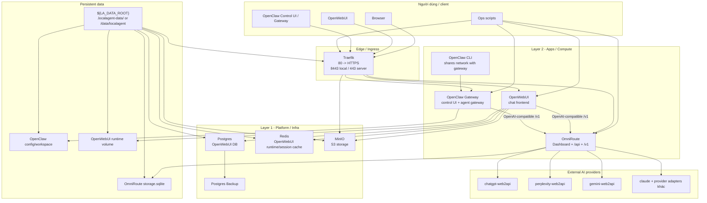
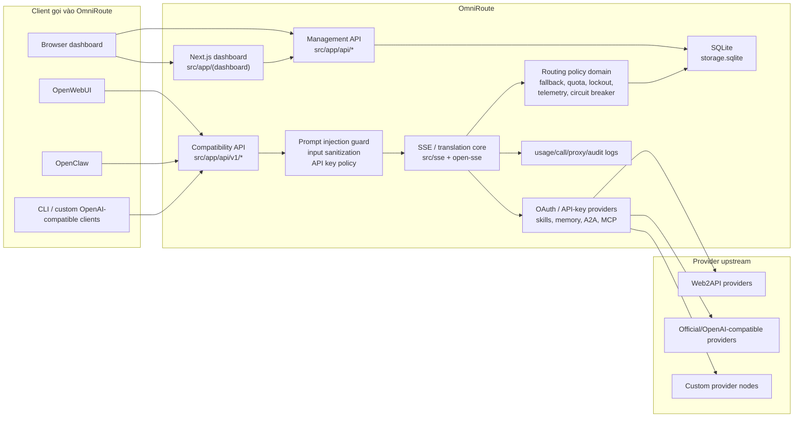
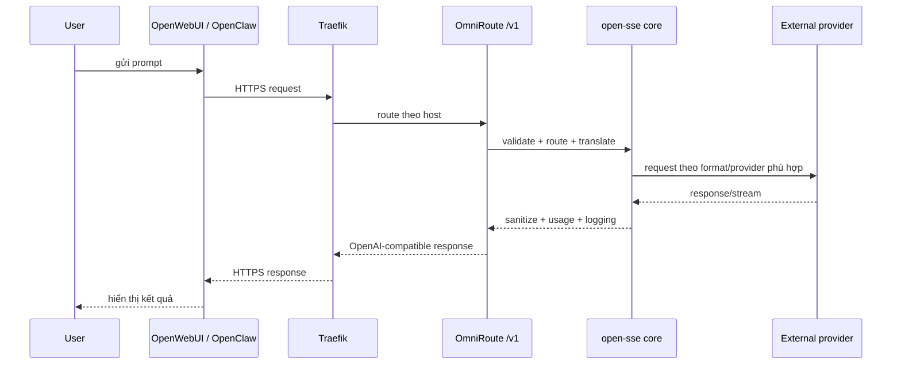
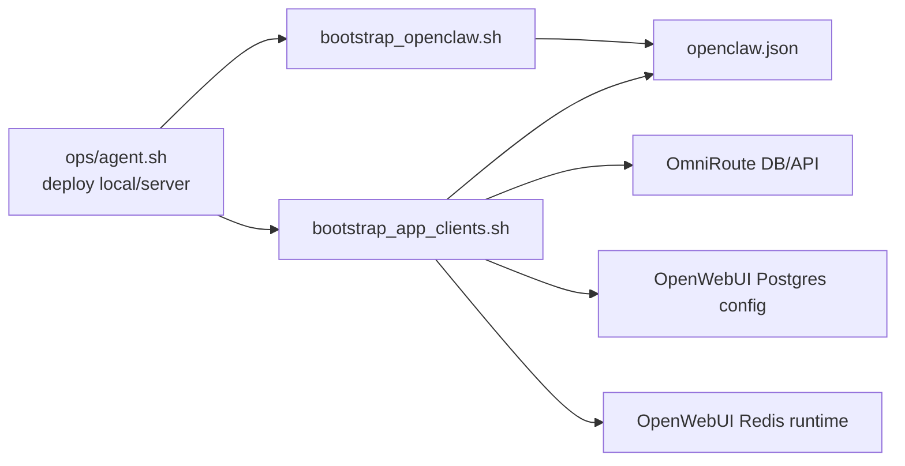

# System Architecture

_Last reviewed: 2026-04-11_

## 1. Mục tiêu của bản vẽ này

Tài liệu này mô tả lại kiến trúc hiện tại của workspace `LocalAgent` sau khi đối chiếu:

- tài liệu root (`README.md`, `docs/WORKSPACE_STRUCTURE.md`, `deploy/DEPLOY_KNOWLEDGE.md`)
- compose deploy thật (`deploy/layer1-platform/docker-compose.yml`, `deploy/layer2-apps/docker-compose.yml`)
- luồng bootstrap/reconcile (`ops/*`, `deploy/scripts/*`)
- entrypoint và cấu phần nội bộ của `OmniRoute`
- cấu hình runtime đang mount trong `.localagent-data/`

Kết luận quan trọng nhất:

- `OmniRoute` là trung tâm của hệ thống hiện tại: vừa là control plane, vừa là API plane.
- `OpenWebUI` và `OpenClaw` không đi thẳng ra provider; cả hai đều được ép gọi `OmniRoute /v1`.
- `Traefik` là ingress duy nhất publish ra host.
- Stack production/local hiện tại là **2-layer Docker stack**, không còn là unified stack cũ.

## 2. Phạm vi active và non-active trong workspace

### Active path

- `deploy/`: source of truth cho stack đang chạy
- `ops/`: entrypoint deploy local/server
- `docs/`: tài liệu vận hành
- `.localagent-data/`: runtime data local đang được container mount
- `OmniRoute/`: router/gateway/dashboard trung tâm
- `open-webui/`: source active, runtime dùng image `ghcr.io/open-webui/open-webui:*`
- `openclaw/`: source active, runtime dùng image build local/custom

### Có trong workspace nhưng không nằm trên deploy path hiện tại

- `claude-code/`: source repo active để tham chiếu/phát triển, không nằm trong layer runtime hiện tại
- `OmniRoute-merge/`: sandbox/experimental clone, không thuộc đường chạy chính

### Legacy / reference / restore only

- `legacy/unified-stack/`
- `legacy/quarantine/`
- `artifacts/`

## 3. Kiến trúc tổng thể của hệ thống



## 4. Vai trò của từng cấu phần

| Thành phần | Vai trò chính | State chính |
| --- | --- | --- |
| `Traefik` | reverse proxy, TLS termination, host routing | cert nội bộ + dynamic config |
| `OmniRoute` | dashboard, management API, OpenAI-compatible `/v1`, routing/fallback/translation | `storage.sqlite`, request logs |
| `OpenWebUI` | giao diện chat cho người dùng cuối | Postgres + Redis + S3 + runtime volume |
| `OpenClaw Gateway` | control UI + gateway agent | file config + workspace local |
| `OpenClaw CLI` | CLI đi cùng gateway, dùng chung network/config | cùng volume với gateway |
| `Postgres` | DB chính cho OpenWebUI | persistent volume |
| `Redis` | cache/runtime/session layer cho OpenWebUI | persistent volume |
| `MinIO` | object storage kiểu S3 cho OpenWebUI | persistent volume |
| `postgres-backup` | backup định kỳ Postgres | `${LA_DATA_ROOT}/platform/backups/postgres` |

## 5. Kiến trúc logic nội bộ của OmniRoute

`OmniRoute` là service phức tạp nhất và là lõi thật của LocalAgent.



### Những khối quan trọng đã xác nhận trong mã nguồn

- Route `/v1/chat/completions` vào [`OmniRoute/src/app/api/v1/chat/completions/route.ts`](/Users/thont/Local/POC/LocalAgent/OmniRoute/src/app/api/v1/chat/completions/route.ts)
- Route này gọi [`OmniRoute/src/sse/handlers/chat.ts`](/Users/thont/Local/POC/LocalAgent/OmniRoute/src/sse/handlers/chat.ts)
- Chat handler chuyển tiếp vào lõi [`OmniRoute/open-sse/handlers/chatCore.ts`](/Users/thont/Local/POC/LocalAgent/OmniRoute/open-sse/handlers/chatCore.ts)
- Rewrites `/v1/* -> /api/v1/*` nằm ở [`OmniRoute/next.config.mjs`](/Users/thont/Local/POC/LocalAgent/OmniRoute/next.config.mjs)
- Startup init cloud sync, compliance log, usage migration nằm ở [`OmniRoute/src/server-init.ts`](/Users/thont/Local/POC/LocalAgent/OmniRoute/src/server-init.ts)

### Phân rã module nội bộ OmniRoute

- `src/app/`: dashboard UI và API routes
- `src/sse/`: entry orchestration cho chat/models/auth
- `open-sse/`: translation, executors, stream handling, provider adapters
- `src/domain/` + `src/lib/db/` + `src/lib/usage/`: policy, state, usage, persistence
- `src/lib/oauth/`: quản lý OAuth/provider credentials
- `src/lib/skills/`, `src/lib/memory/`, `src/lib/acp/`, `src/lib/a2a/`: capability mở rộng
- `src/mitm/`: TLS/proxy/MITM tooling, không phải đường chat chính của stack 2-layer hiện tại

## 6. Luồng request chuẩn của hệ thống

### 6.1 Luồng chat từ UI/gateway đến provider



### 6.2 Luồng bootstrap/reconcile cấu hình ứng dụng

`LocalAgent` có một lớp orchestration riêng để ép các app downstream dùng đúng OmniRoute.



Ý nghĩa của lớp này:

- cấp và reconcile app API key cho `OpenWebUI` và `OpenClaw`
- sync `OpenWebUI` về đúng `http://omniroute:<port>/v1` ở cả **Postgres** lẫn **Redis**
- seed `OpenClaw` chỉ dùng provider `omniroute`
- set HTTPS origin/trusted proxy cho `OpenClaw Control UI`

## 7. Kiến trúc state và persistence

```text
${LA_DATA_ROOT}/
  platform/
    db/primary                # Postgres data cho OpenWebUI
    backups/postgres          # backup định kỳ
    redis/data                # Redis persistence
    minio/data                # object storage
    proxy/
      traefik/dynamic.yml     # generated
      traefik/ca/ca.crt       # generated internal CA
      traefik/certs/*         # generated leaf cert
      extra-ca/extra-ca.pem   # CA bổ sung cho upstream TLS
    logs/
      postgres/
      redis/
      minio/
      traefik/
  apps/
    omniroute/
      data/                   # storage.sqlite + app data
      logs/
    open-webui/
      runtime/
    openclaw/
      config/                 # openclaw.json
      workspace/
```

### Phân mảnh state hiện tại

- `OmniRoute`: **stateful**, lưu local trong SQLite
- `OpenWebUI`: **externalized state** tương đối tốt qua Postgres + Redis + MinIO
- `OpenClaw`: **file-based state** trong config/workspace volume

Điều này dẫn tới quyết định vận hành hiện tại:

- `OpenWebUI` có thể scale ngang dễ hơn
- `OmniRoute` vẫn nên chạy 1 replica ổn định
- `OpenClaw Gateway` hiện cũng thiên về single-instance

## 8. Control plane triển khai

### Entry points chuẩn

- local: `bash ops/agent.sh deploy local`
- server: `SERVER_SSH_PASS='***' bash ops/agent.sh deploy server`

### Những script quan trọng

- [`ops/deploy_local.sh`](/Users/thont/Local/POC/LocalAgent/ops/deploy_local.sh): build arm64 image, tạo env local, up stack, reconcile runtime
- [`ops/deploy_server.sh`](/Users/thont/Local/POC/LocalAgent/ops/deploy_server.sh): build amd64 OmniRoute, sync `deploy/`, rollout server
- [`deploy/scripts/stack.sh`](/Users/thont/Local/POC/LocalAgent/deploy/scripts/stack.sh): wrapper cho `docker compose`
- [`deploy/scripts/bootstrap_tls.sh`](/Users/thont/Local/POC/LocalAgent/deploy/scripts/bootstrap_tls.sh): generate internal CA/cert cho Traefik
- [`deploy/scripts/render_traefik_dynamic.sh`](/Users/thont/Local/POC/LocalAgent/deploy/scripts/render_traefik_dynamic.sh): render host routing
- [`deploy/scripts/bootstrap_openclaw.sh`](/Users/thont/Local/POC/LocalAgent/deploy/scripts/bootstrap_openclaw.sh): fix OpenClaw origin/proxy/device auth
- [`deploy/scripts/bootstrap_app_clients.sh`](/Users/thont/Local/POC/LocalAgent/deploy/scripts/bootstrap_app_clients.sh): reconcile app keys và downstream config
- [`deploy/scripts/healthcheck.sh`](/Users/thont/Local/POC/LocalAgent/deploy/scripts/healthcheck.sh): check ingress/HTTPS
- [`deploy/scripts/smoke_stack.sh`](/Users/thont/Local/POC/LocalAgent/deploy/scripts/smoke_stack.sh): test end-to-end qua OmniRoute

## 9. Quan sát runtime hiện tại sau khi audit

Các điểm sau được xác nhận từ runtime local đang chạy:

- stack local đang có đủ các container chính của 2-layer deploy
- `OpenClaw` runtime hiện chỉ có đúng một model provider là `omniroute`
- `OpenClaw` đang trỏ về `http://omniroute:20129/v1`
- `OpenClaw Control UI` đang allow origin HTTPS local và trust Traefik edge IP
- dữ liệu local đang mount dưới `.localagent-data/`

Các điểm này nên xem là **runtime observation**, không phải invariant bất biến của mọi môi trường.

## 10. Kết luận kiến trúc

Nếu mô tả hệ thống bằng một câu:

> LocalAgent hiện là một **private AI platform 2 lớp**, trong đó `Traefik` làm ingress, `OmniRoute` làm lõi điều phối và chuẩn hóa API, còn `OpenWebUI` và `OpenClaw` là hai mặt tiêu thụ/điều khiển bám vào `OmniRoute`.

Điểm đáng chú ý nhất của kiến trúc hiện tại:

1. `OmniRoute` là điểm tập trung logic lớn nhất và cũng là single point of orchestration.
2. `OpenWebUI` và `OpenClaw` đã được “thuần hóa” để dùng `OmniRoute` làm upstream duy nhất.
3. State của hệ thống đang bị chia thành 3 kiểu:
   - SQLite local của `OmniRoute`
   - Postgres/Redis/MinIO của `OpenWebUI`
   - file config/workspace của `OpenClaw`
4. `deploy/scripts/bootstrap_*` là lớp keo dán bắt buộc để giữ các app downstream đồng bộ với router trung tâm.

Nếu cần bước tiếp theo, tài liệu này có thể được mở rộng thành:

- sơ đồ sequence cho login/auth/bootstrap
- sơ đồ chi tiết module nội bộ `OmniRoute`
- sơ đồ dependency giữa các repo active trong workspace
